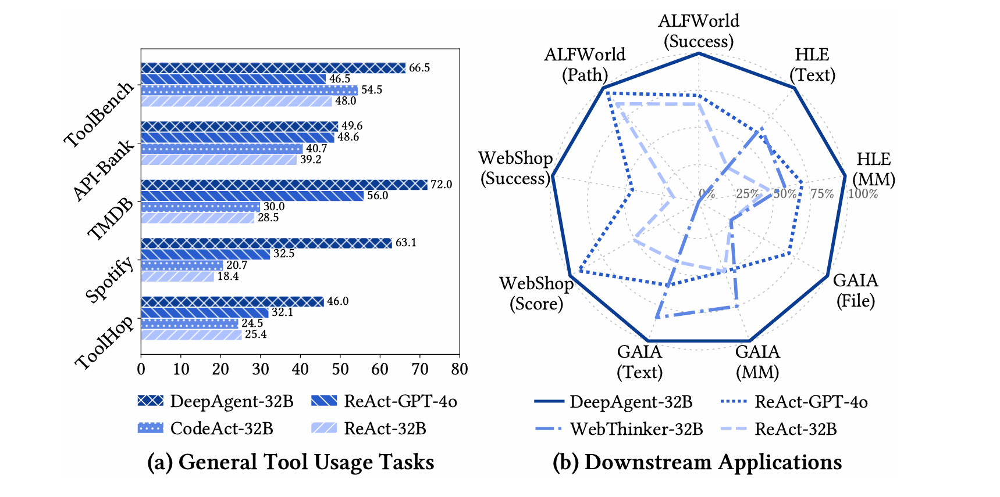

<h1 align="center"> <br>A General Reasoning Agent with Scalable Toolsets</a></h1>

<div align="center"> 

[](https://opensource.org/licenses/MIT) 
[](https://www.python.org/downloads/release/python-390/) 
</div>

<div align="center">
  
</div>

## 🎬 Demos

*Note: If demo videos cannot be displayed on Anonymous GitHub, you can download them and view locally. We compressed each video to < 10MB.*

<!-- <table>
  <thead>
    <tr>
      <th width="50%" align="center">General Agent Task with 16,000+ RapidAPIs</a></th>
      <th width="50%" align="center">Embodied AI Agent Task in ALFWorld Env.</a></th>
    </tr>
  </thead>
  <tbody>
    <tr>
      <td align="center">
        <video src="https://github.com/user-attachments/assets/7aa586e9-a47a-425d-8d41-99226d2f6835" width="50%"></video>
      </td>
      <td align="center">
        <video src="https://github.com/user-attachments/assets/0fa74beb-cc9a-4316-a49c-54dbaa22ad81" width="50%"></video>
      </td>
    </tr>
    <tr>
      <td align="left">
        <b>DeepAgent</b> is a reasoning agent with scalable toolsets, it can handle general tasks with 16,000+ RapidAPIs by searching for and using the appropriate tools with deep agentic reasoning. 
        <br>
        <br>
        Rather than requiring humans to pre-define relevant tools for each task scenario, the model autonomously explores and selects appropriate tools to use, which fully unleashes the agent's autonomy.
      </td>
      <td align="left">
        <b>DeepAgent</b> can also handle navigation tasks (e.g., Web Agent and Embodied AI Agent tasks) with pluggable actions (e.g., moving, looking, taking, etc). 
        <br>
        <br>
        It can adjust the strategy dynamically based on the environment feedback, thus accomplishing the task within an end-to-end agentic reasoning process.
      </td>
    </tr>
  </tbody>
</table> -->

<details open>
<summary><h3>1. General Agent Task with 16,000+ RapidAPIs</h3></summary>

<div align="center">
    <video src="https://github.com/user-attachments/assets/7aa586e9-a47a-425d-8d41-99226d2f6835" />
</div>

**DeepAgent** is a reasoning agent with scalable toolsets, capable of tackling general tasks by searching for and using the appropriate tools from over 16,000 RapidAPIs in an end-to-end agentic reasoning process. *(Note: Due to some APIs in ToolBench being unavailable, API responses are simulated in this demo to demonstrate the system's capabilities.)*

</details>

<details>
<summary><h3>2. Embodied AI Agent Task in ALFWorld Env.</h3></summary>

<div align="center">
  <video src="https://github.com/user-attachments/assets/fe309384-9102-4d1e-a929-f8b9b4041243" />
</div>

**DeepAgent** also excels at navigation-based tasks (e.g., web browsing, OS interaction, and embodied AI) by using a versatile set of pluggable actions such as moving, looking, and taking.
</details>

<details>
<summary><h3>3. Deep Research Task with Specialized Tools</h3></summary>

<div align="center">
  <video src="https://github.com/user-attachments/assets/a6278bfd-2ee9-44aa-9f74-82aa826d8778" />
</div>

**DeepAgent** can also serve as a powerful research assistant, equipped with specialized tools for web search, browsing, code execution, visual QA, and file processing.
</details>


## 💡 Overview

**DeepAgent** is an reasoning agent that empowers large language models to solve complex tasks by dynamically searching for and utilizing tools. Unlike traditional agents with fixed toolsets, DeepAgent can operate in both open-set (searching for tools) and closed-set (using a given set of tools) environments.

When an agent gets stuck, or its reasoning history becomes too long, it can "fold" its thoughts. The framework then summarizes the progress, creating condensed "episode," "working," and "tool" memories, allowing the agent to start a new line of reasoning with the benefit of past experience but without the overwhelming context.

### 📊 Overall Performance

<div align="center">
  
</div>

As shown in our results, DeepAgent demonstrates strong performance across a wide variety of benchmarks, including complex question answering, embodied AI tasks, and web navigation.

### ✨ The DeepAgent Framework


**DeepAgent** enhances LLMs with the ability to reason about which tools they need, find them, and use them to accomplish tasks. The thought-folding mechanism provides a structured way to handle very long reasoning chains and recover from errors.


**Key Features:**
- **Dynamic Tool Search**: DeepAgent can search for tools when it doesn't have the right one for the job, making it adaptable to new problems.
- **Versatile Tool Calling**: It can interact with a wide array of tools, from web search and Python execution to specialized APIs for embodied agents in environments like ALFWorld and WebShop.
- **Thought Folding for Long-Context Reasoning**: When faced with a complex problem requiring many steps, DeepAgent can use "thought folding" to summarize its progress and prune its reasoning history. This creates three types of memory:
    - **Episode Memory**: A summary of key events and decisions.
    - **Working Memory**: A snapshot of the immediate goal and challenges.
    - **Tool Memory**: A synthesis of tool usage patterns, successes, and failures.
- **Broad Benchmark Support**: DeepAgent is designed to work with a diverse set of challenging benchmarks, including GAIA, HLE, ToolBench, ALFWorld, WebShop, and more.

## 🔧 Installation

###  Environment Setup
```bash
# Create conda environment
conda create -n deepagent python=3.9
conda activate deepagent

# Install requirements
# Note: A requirements.txt file is not provided. 
# Please install dependencies based on the imports in the source code.
# Key dependencies include:
pip install torch transformers sentence-transformers openai-async pyyaml
```

## 🏃 Quick Start

### Pre-preparation

#### Model Serving
Before running DeepAgent, ensure your reasoning model and auxiliary model are served using a framework like vLLM. DeepAgent is designed to work with powerful reasoning models as the main agent and can use an auxiliary model for tasks like memory generation and tool selection.

### Problem Solving Mode

To run on a benchmark dataset with tool search enabled, use the following command:
    
    ```bash
    python src/run_deep_agent.py \
        --config_path ./config/base_config.yaml \
        --dataset_name toolbench \
        --enable_tool_search \
        --eval
    ```

To run on a benchmark dataset with closed-set mode, use the following command:
    
    ```bash
    python src/run_deep_agent.py \
        --config_path ./config/base_config.yaml \
        --dataset_name gaia \
        --eval
    ```

**Parameters Explanation:**
- `--config_path`: Path to the main configuration file.
- `--dataset_name`: Name of the dataset to use (e.g., `gaia`, `hle`, `toolbench`, `api_bank`, `tmdb`, `spotify`, `toolhop`, `alfworld`, `webshop`).
- `--subset_num`: Number of samples to run from the dataset.
- `--enable_tool_search`: Allows the agent to search for tools. If disabled, it will only use the tools provided for the task (closed-set).
- `--enable_thought_folding`: Allows the agent to use the thought folding mechanism.
- `--eval`: Run evaluation on the results after generation.

### Benchmarks

The benchmarks we utilize are categorized into several types:
- **Complex Reasoning Benchmarks:** 
    - [GAIA](https://arxiv.org/abs/2311.12983)
    - [Humanity's Last Exam (HLE)](https://arxiv.org/abs/2501.14249)
- **Tool Use Benchmarks:**
    - [ToolBench](https://arxiv.org/abs/2307.16789)
    - [ToolHop](https://arxiv.org/abs/2305.18754)
    - [API-Bank](https://arxiv.org/abs/2304.08244)
    - [RestBench](https://arxiv.org/abs/2311.12983)
- **Embodied Agent Benchmarks:**
    - [ALFWorld](https://arxiv.org/abs/2010.03768)
- **Web Navigation Benchmarks:**
    - [WebShop](https://arxiv.org/abs/2207.01206)

All the pre-processed data can be found in the `./data/` directory.

### Evaluation

Our model inference script can automatically save the model's input and output for evaluation. To run the evaluation, use the `--eval` flag when running `run_deep_agent.py`. The evaluation scripts for each dataset are located in `src/evaluate/`.

## 📄 License

This project is released under the [MIT License](LICENSE).
